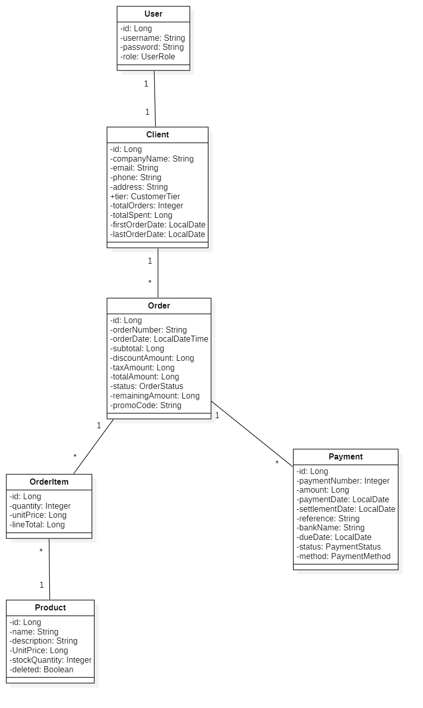

# 🛒 SmartShop - E-Commerce Backend Application

[](https://www.oracle.com/java/)
[](https://spring.io/projects/spring-boot)
[](https://www.postgresql.org/)
[](LICENSE)

SmartShop est une application backend e-commerce professionnelle développée avec Spring Boot, offrant une gestion complète des produits, commandes, clients, paiements et codes promotionnels. L'application implémente une architecture RESTful avec authentification par session, gestion des rôles utilisateurs (ADMIN/CLIENT), et un système de soft delete pour les entités.

---

## 📋 Table des Matières

- [Fonctionnalités](#-fonctionnalités)
- [Architecture](#-architecture)
- [Diagramme de Classes](#-diagramme-de-classes)
- [Technologies Utilisées](#-technologies-utilisées)
- [Prérequis](#-prérequis)
- [Installation](#-installation)
- [Configuration](#-configuration)
- [Démarrage](#-démarrage)
- [Documentation API](#-documentation-api)
- [Tests Postman](#-tests-postman)
- [Structure du Projet](#-structure-du-projet)
- [Auteur](#-auteur)

---

## ✨ Fonctionnalités

### 🔐 Authentification & Autorisation
- **Session-based Authentication** : Authentification par session HTTP avec SessionService
- **Gestion des rôles** : ADMIN et CLIENT avec permissions différenciées
- **Hachage sécurisé** : Mots de passe hashés avec BCrypt (jBCrypt)
- **Service de session** : SessionService pour gérer les sessions utilisateur

### 👥 Gestion des Clients
- CRUD complet des clients
- Système de tiers clients (BASIC, SILVER, GOLD, PLATINUM)
- Statistiques clients automatiques (total commandes, montant dépensé)
- Soft delete pour préserver l'intégrité des données
- Récupération des top clients par montant dépensé

### 📦 Gestion des Produits
- CRUD complet des produits
- Gestion du stock en temps réel
- Soft delete avec filtrage automatique
- Recherche et filtrage des produits

### 🛍️ Gestion des Commandes
- Création de commandes avec items multiples
- Calcul automatique des totaux (sous-total, taxes, remises)
- Application de codes promotionnels
- Statuts de commandes (PENDING, CONFIRMED, REJECTED, CANCELLED)
- Mise à jour automatique des statistiques clients
- Groupement des commandes par statut de paiement
- Statistiques des commandes par statut

### 💳 Gestion des Paiements
- Support de paiements multiples par commande
- Types de paiement : ESPECES, VIREMENT, CHEQUE
- Statuts de paiement : EN_ATTENTE, ENCAISSE, REJETE, ANNULEE
- Gestion des échéances pour les chèques
- Mise à jour automatique du montant restant

### 🎟️ Codes Promotionnels
- Création et gestion de codes promo
- Pourcentage de réduction configurable
- Limitation d'usage (max usage)
- Activation/désactivation des codes
- Validation automatique lors de l'application

---

## 🏗️ Architecture

SmartShop suit une architecture en couches (Layered Architecture) basée sur les principes de Spring Boot :

```
┌─────────────────────────────────────┐
│     Controllers (REST API)          │  ← Endpoints HTTP
├─────────────────────────────────────┤
│     Services (Business Logic)       │  ← Logique métier
├─────────────────────────────────────┤
│     Repositories (Data Access)      │  ← Accès aux données
├─────────────────────────────────────┤
│     Entities (Domain Model)         │  ← Modèle de données
├─────────────────────────────────────┤
│     PostgreSQL Database             │  ← Persistance
└─────────────────────────────────────┘
```

### Composants Clés

- **DTOs (Data Transfer Objects)** : Séparation entre modèle de domaine et API
- **MapStruct Mappers** : Conversion automatique Entity ↔ DTO
- **Custom Exceptions** : Gestion d'erreurs métier spécifiques
- **SessionService** : Gestion des sessions utilisateur et authentification
- **StockService** : Gestion du stock des produits
- **DataSeeder** : Initialisation automatique des données de test

---

## 📊 Diagramme de Classes

Le diagramme ci-dessous illustre les relations entre les entités principales de l'application :



### Relations Principales

| Relation | Type | Description |
|----------|------|-------------|
| **User ↔ Client** | One-to-One | Un utilisateur peut être lié à un client |
| **Client ↔ Order** | One-to-Many | Un client peut avoir plusieurs commandes |
| **Order ↔ OrderItem** | One-to-Many | Une commande contient plusieurs items |
| **Product ↔ OrderItem** | One-to-Many | Un produit peut être dans plusieurs items |
| **Order ↔ Payment** | One-to-Many | Une commande peut avoir plusieurs paiements |

---

## 🛠️ Technologies Utilisées

### Backend Framework
- **Java 17** - Langage de programmation
- **Spring Boot 2.7.14** - Framework principal
- **Spring Data JPA** - Couche de persistance
- **Hibernate** - ORM (Object-Relational Mapping)

### Base de Données
- **PostgreSQL** - Base de données relationnelle

### Sécurité
- **BCrypt (jBCrypt 0.4)** - Hachage des mots de passe
- **Session-based Authentication** - Authentification manuelle

### Utilitaires
- **Lombok** - Réduction du code boilerplate
- **MapStruct 1.5.5** - Mapping Entity ↔ DTO
- **Spring Validation** - Validation des données
- **Spring Dotenv 4.0.0** - Gestion des variables d'environnement

### Documentation & Tests
- **Springdoc OpenAPI 1.6.15** - Documentation Swagger
- **JUnit 5** - Tests unitaires
- **Mockito** - Mocking pour les tests
- **Spring Boot Test** - Tests d'intégration

### Build & Déploiement
- **Maven** - Gestion des dépendances et build
- **Maven Compiler Plugin 3.8.1** - Compilation avec annotation processors

---

## 📋 Prérequis

Avant de commencer, assurez-vous d'avoir installé :

- ✅ **Java JDK 17** ou supérieur
- ✅ **Maven 3.6+** pour la gestion des dépendances
- ✅ **PostgreSQL 12+** pour la base de données
- ✅ **Git** pour cloner le repository
- ✅ **Postman** (optionnel) pour tester l'API

---

## 🚀 Installation

### 1. Cloner le Repository

```bash
git clone https://github.com/Kawtar-Shaimi/smartShop.git
cd smartShop
```

### 2. Créer la Base de Données

Connectez-vous à PostgreSQL et créez la base de données :

```sql
CREATE DATABASE smartshop_db;
```

### 3. Configurer les Variables d'Environnement

Créez un fichier `.env` à la racine du projet :

```env
DB_URL=jdbc:postgresql://localhost:5432/smartshop_db
DB_USERNAME=smartshop_user
DB_PASSWORD=your_password
```

### 4. Installer les Dépendances

```bash
mvn clean install
```

---

## ⚙️ Configuration

### Application Configuration

Le fichier `src/main/resources/application.yaml` contient la configuration principale :

```yaml
server:
  port: 8081

spring:
  datasource:
    url: ${DB_URL}
    username: ${DB_USERNAME}
    password: ${DB_PASSWORD}
    driverClassName: org.postgresql.Driver

  jpa:
    database-platform: org.hibernate.dialect.PostgreSQLDialect
    hibernate:
      ddl-auto: create-drop
    show-sql: true
    properties:
      hibernate:
        format_sql: true

smartshop:
  tva-rate: 0.20
```

### Données de Test

L'application inclut un `DataSeeder` qui initialise automatiquement :
- Un compte administrateur : **kawtar** / **kawtar123**
- 6 clients de test (entreprises IT : IBM, HPS, Microsoft, Oracle, Capgemini, Accenture)
- 15 produits informatiques (PC, écrans, périphériques)
- Comptes utilisateurs pour chaque client (format: `nom_entreprise` / `NOM_ENTREPRISE123`)

---

## 🎯 Démarrage

### Démarrer l'Application

```bash
mvn spring-boot:run
```

L'application sera accessible sur : **http://localhost:8081**

### Accéder à la Documentation Swagger

Une fois l'application démarrée, accédez à :

**http://localhost:8081/swagger-ui.html**

---

## 📚 Documentation API

### Endpoints d'Authentification

#### POST `/api/auth/login`
Connexion utilisateur

**Request Body:**
```json
{
  "username": "kawtar",
  "password": "kawtar123"
}
```

**Response:**
```json
{
  "id": 1,
  "username": "kawtar",
  "role": "ADMIN",
  "clientId": null
}
```


#### POST `/api/auth/logout`
Déconnexion utilisateur

---

### Endpoints Clients

#### GET `/api/clients`
Récupérer tous les clients (ADMIN uniquement)

**Response:**
```json
[
  {
    "id": 1,
    "nom": "IBM",
    "email": "ibm@example.com",
    "tier": "GOLD",
    "totalOrders": 5,
    "totalSpent": 15000.00,
    "firstOrderDate": "2024-01-15T10:30:00",
    "lastOrderDate": "2024-12-10T14:20:00"
  }
]
```


#### GET `/api/clients/{id}`
Récupérer un client par ID


#### POST `/api/clients`
Créer un nouveau client (ADMIN uniquement)

**Request Body:**
```json
{
  "nom": "TechCorp",
  "email": "contact@techcorp.com",
  "tier": "BASIC"
}
```


#### PUT `/api/clients/{id}`
Mettre à jour un client

#### DELETE `/api/clients/{id}`
Supprimer un client (soft delete)

#### GET `/api/clients/top`
Récupérer les top clients par montant dépensé

**Query Parameters:**
- `limit` (optionnel, défaut: 10)

---

### Endpoints Produits

#### GET `/api/products`
Récupérer tous les produits (non supprimés)

**Response:**
```json
[
  {
    "id": 1,
    "nom": "Laptop Dell XPS 15",
    "description": "Laptop professionnel haute performance",
    "price": 1299.99,
    "stock": 25,
    "deleted": false
  }
]
```


#### GET `/api/products/{id}`
Récupérer un produit par ID


#### POST `/api/products`
Créer un nouveau produit (ADMIN uniquement)

**Request Body:**
```json
{
  "nom": "MacBook Pro 16",
  "description": "Laptop Apple M2 Pro",
  "price": 2499.99,
  "stock": 15
}
```


#### PUT `/api/products/{id}`
Mettre à jour un produit (ADMIN uniquement)


#### DELETE `/api/products/{id}`
Supprimer un produit (soft delete, ADMIN uniquement)

---

### Endpoints Commandes

#### GET `/api/orders`
Récupérer toutes les commandes

**Response:**
```json
[
  {
    "id": 1,
    "clientId": 1,
    "date": "2024-12-10T10:00:00",
    "subTotal": 2599.98,
    "discountAmount": 259.99,
    "taxAmount": 468.00,
    "totalAmount": 2807.99,
    "promoCode": "PROMO-TECH",
    "status": "CONFIRMED",
    "remainingAmount": 0.00,
    "items": [
      {
        "productId": 1,
        "quantity": 2,
        "unitPrice": 1299.99,
        "totalLine": 2599.98
      }
    ]
  }
]
```


#### GET `/api/orders/{id}`
Récupérer une commande par ID


#### POST `/api/orders`
Créer une nouvelle commande

**Request Body:**
```json
{
  "clientId": 1,
  "promoCode": "PROMO-TECH",
  "items": [
    {
      "productId": 1,
      "quantity": 2
    },
    {
      "productId": 3,
      "quantity": 1
    }
  ]
}
```


#### GET `/api/orders/stats/by-status`
Obtenir les statistiques des commandes par statut

**Response:**
```json
{
  "PENDING": 5,
  "CONFIRMED": 12,
  "SHIPPED": 8,
  "DELIVERED": 20,
  "CANCELLED": 2
}
```

#### GET `/api/orders/grouped-by-payment`
Grouper les commandes par statut de paiement

---

### Endpoints Paiements

#### GET `/api/payments`
Récupérer tous les paiements

**Response:**
```json
[
  {
    "id": 1,
    "orderId": 1,
    "paymentNumber": 1,
    "amount": 1500.00,
    "type": "CREDIT_CARD",
    "status": "COMPLETED",
    "paymentDate": "2024-12-10T11:00:00",
    "cashingDate": "2024-12-10T11:05:00",
    "reference": "REF-001",
    "bank": "Bank of America"
  }
]
```


#### GET `/api/payments/order/{orderId}`
Récupérer les paiements d'une commande


#### POST `/api/payments`
Créer un nouveau paiement

**Request Body:**
```json
{
  "orderId": 1,
  "amount": 1500.00,
  "type": "CREDIT_CARD",
  "status": "COMPLETED",
  "reference": "REF-001",
  "bank": "Bank of America"
}
```


---

### Endpoints Codes Promotionnels

#### GET `/api/promo-codes`
Récupérer tous les codes promo (ADMIN uniquement)

**Response:**
```json
[
  {
    "id": 1,
    "code": "PROMO-TECH",
    "discountPercentage": 10.00,
    "active": true,
    "maxUsage": 100,
    "currentUsage": 15
  }
]
```


#### GET `/api/promo-codes/{code}`
Récupérer un code promo par code


#### POST `/api/promo-codes`
Créer un nouveau code promo (ADMIN uniquement)

**Request Body:**
```json
{
  "code": "PROMO-XMAS",
  "discountPercentage": 15.00,
  "active": true,
  "maxUsage": 50
}
```


#### POST /api/promo-codes/{code}/deactivate

---

## 🧪 Tests Postman

### Collection Postman

Une collection Postman complète est disponible pour tester tous les endpoints de l'API.

### Scénarios de Test

#### 1. Authentification

**Test 1.1 : Login Admin**
```
POST http://localhost:8081/api/auth/login
Body:
{
  "username": "kawtar",
  "password": "kawtar123"
}

Expected: 200 OK avec données utilisateur
```

**Test 1.2 : Login Client**
```
POST http://localhost:8081/api/auth/login
Body:
{
  "username": "ibm",
  "password": "IBM123"
}

Expected: 200 OK avec données utilisateur et clientId
```

**Test 1.3 : Login avec mauvais credentials**
```
POST http://localhost:8081/api/auth/login
Body:
{
  "username": "kawtar",
  "password": "wrongpassword"
}

Expected: 401 Unauthorized
```

#### 2. Gestion des Clients

**Test 2.1 : Récupérer tous les clients (ADMIN)**
```
GET http://localhost:8081/api/clients

Expected: 200 OK avec liste des clients
```

**Test 2.2 : Créer un nouveau client (ADMIN)**
```
POST http://localhost:8081/api/clients
Body:
{
  "nom": "Microsoft",
  "email": "contact@microsoft.com",
  "tier": "PLATINUM"
}

Expected: 201 Created
```

**Test 2.3 : Récupérer top clients**
```
GET http://localhost:8081/api/clients/top?limit=5

Expected: 200 OK avec top 5 clients
```

#### 3. Gestion des Produits

**Test 3.1 : Récupérer tous les produits**
```
GET http://localhost:8081/api/products

Expected: 200 OK avec liste des produits
```

**Test 3.2 : Créer un produit (ADMIN)**
```
POST http://localhost:8081/api/products
Body:
{
  "nom": "iPhone 15 Pro",
  "description": "Smartphone Apple dernière génération",
  "price": 1199.99,
  "stock": 50
}

Expected: 201 Created
```

**Test 3.3 : Soft delete d'un produit (ADMIN)**
```
DELETE http://localhost:8081/api/products/1

Expected: 204 No Content
```

#### 4. Gestion des Commandes

**Test 4.1 : Créer une commande avec code promo**
```
POST http://localhost:8081/api/orders
Body:
{
  "clientId": 1,
  "promoCode": "PROMO-TECH",
  "items": [
    {
      "productId": 1,
      "quantity": 2
    }
  ]
}

Expected: 201 Created avec calculs automatiques
```

**Test 4.2 : Mettre à jour le statut (ADMIN)**
```
PUT http://localhost:8081/api/orders/1/status
Body:
{
  "status": "SHIPPED"
}

Expected: 200 OK
```

**Test 4.3 : Statistiques par statut**
```
GET http://localhost:8081/api/orders/stats/by-status

Expected: 200 OK avec statistiques
```

#### 5. Gestion des Paiements

**Test 5.1 : Créer un paiement**
```
POST http://localhost:8081/api/payments
Body:
{
  "orderId": 1,
  "amount": 1000.00,
  "type": "CREDIT_CARD",
  "status": "COMPLETED",
  "reference": "PAY-001"
}

Expected: 201 Created avec mise à jour du remainingAmount
```

**Test 5.2 : Récupérer paiements d'une commande**
```
GET http://localhost:8081/api/payments/order/1

Expected: 200 OK avec liste des paiements
```

#### 6. Codes Promotionnels

**Test 6.1 : Créer un code promo (ADMIN)**
```
POST http://localhost:8081/api/promo-codes
Body:
{
  "code": "PROMO-2024",
  "discountPercentage": 20.00,
  "active": true,
  "maxUsage": 100
}

Expected: 201 Created
```

**Test 6.2 : Valider un code promo**
```
GET http://localhost:8081/api/promo-codes/PROMO-2024

Expected: 200 OK si actif et usage disponible
```


## 📁 Structure du Projet

```
smartShop/
├── src/
│   ├── main/
│   │   ├── java/com/demo/smartShop/
│   │   │   ├── config/              # Configuration (DataSeeder)
│   │   │   ├── controller/          # REST Controllers
│   │   │   ├── dto/                 # Data Transfer Objects
│   │   │   ├── entity/              # JPA Entities
│   │   │   │   └── enums/           # Enumerations
│   │   │   ├── exception/           # Custom Exceptions
│   │   │   ├── mapper/              # MapStruct Mappers
│   │   │   ├── repository/          # Spring Data Repositories
│   │   │   ├── service/             # Service Interfaces
│   │   │   │   └── impl/            # Service Implementations (AuthServiceImpl, ClientServiceImpl, OrderServiceImpl, PaymentServiceImpl, ProductServiceImpl, PromoCodeServiceImpl, SessionServiceImpl, StockServiceImpl)
│   │   │   └── util/                # Utilities (PasswordUtil)
│   │   └── resources/
│   │       ├── application.yaml
│   │       └── static/
│   └── test/                        # Tests unitaires et d'intégration
├── diagrams/                        # Diagrammes UML
│   └── SmartShop_ClassDiagram.png
├── .env                             # Variables d'environnement
├── pom.xml                          # Configuration Maven
└── README.md                        # Ce fichier
```

---

## 👨‍💻 Auteur

**Kawtar Shaimi**

- GitHub: [Kawtar-Shaimi](https://github.com/Kawtar-Shaimi)
- Email: kawtar.shaimi8@gmail.com

---

